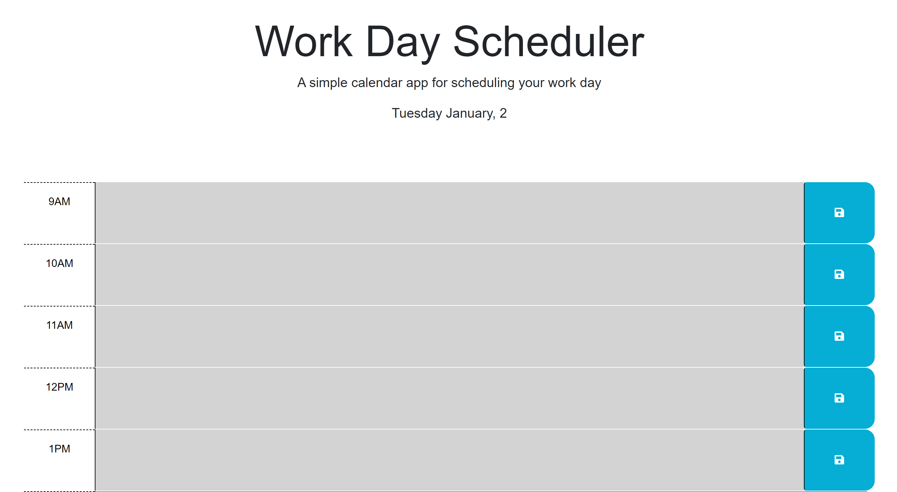
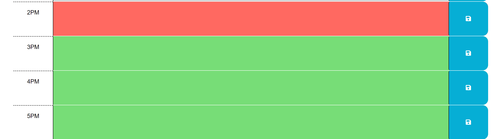
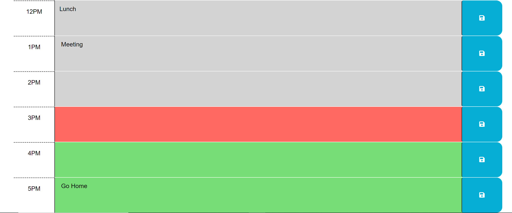

# Work-Schedule-App

## Description

This is a work day schedule app for a typical 9-5 workday. This app is meant to help users stay organized and keep track of any tasks they might have throughout the day.

## Installation

N/A

## Usage

To see the application in action you can follow this link: https://shaneleejohnson.github.io/Work-Schedule-App/

This application will update daily and tell you the current day and month at the top of page. To use this application you can select any time block and type in whatever you need to keep track of for any specific hour between 9am to 5pm. Whatever you save will be saved locally and will stay even after refreshing the page. The time blocks are color coded and will be grey if the current time is later than the time block, red if the time block is the current time, or green if the time block is an hour that is later than the current time.

The following screenshots show the functionality of the app

## Credits

Starter code from UTSA Full Stack Web Development Bootcamp: https://github.com/coding-boot-camp/crispy-octo-meme

## License

Please refer to the LICENSE in the repo.